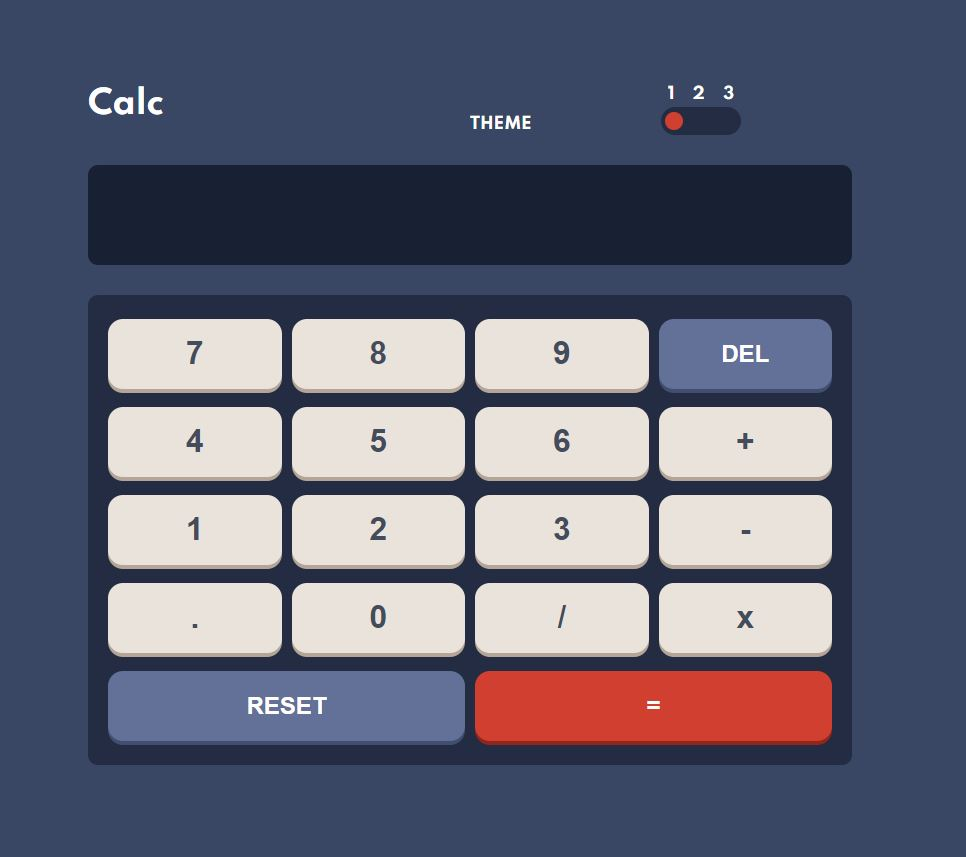
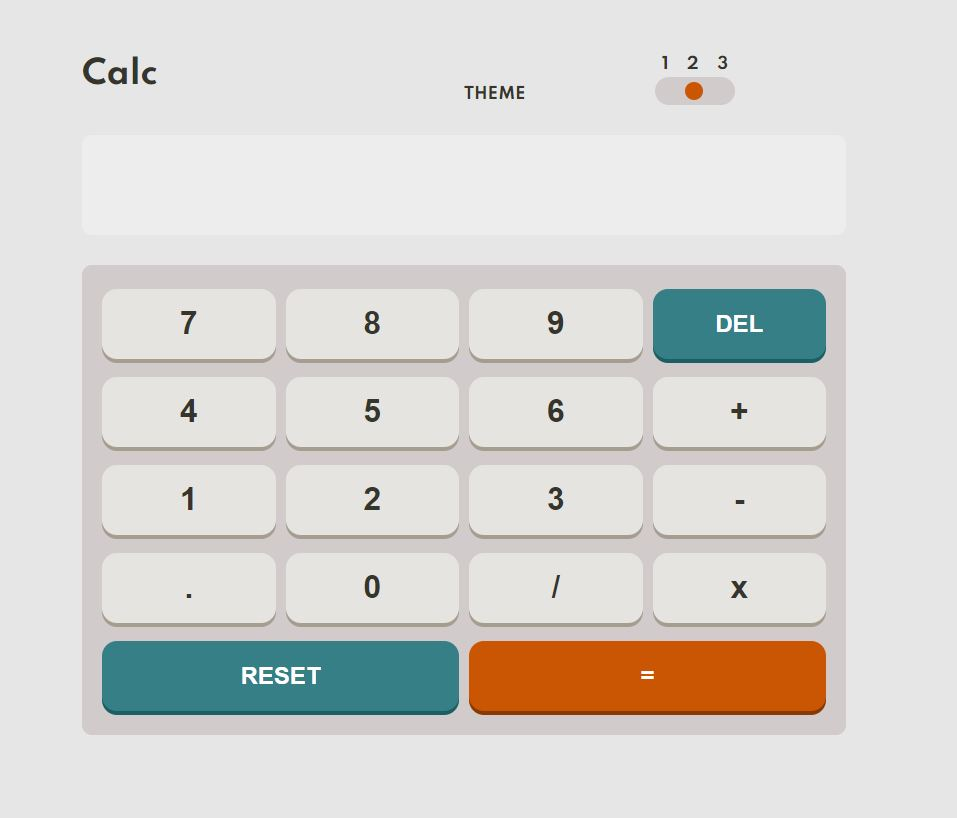
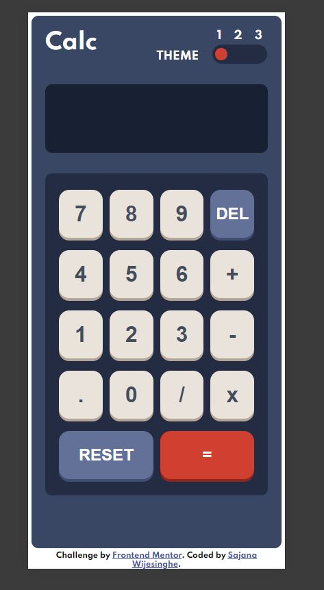
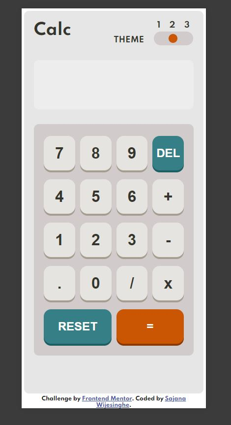
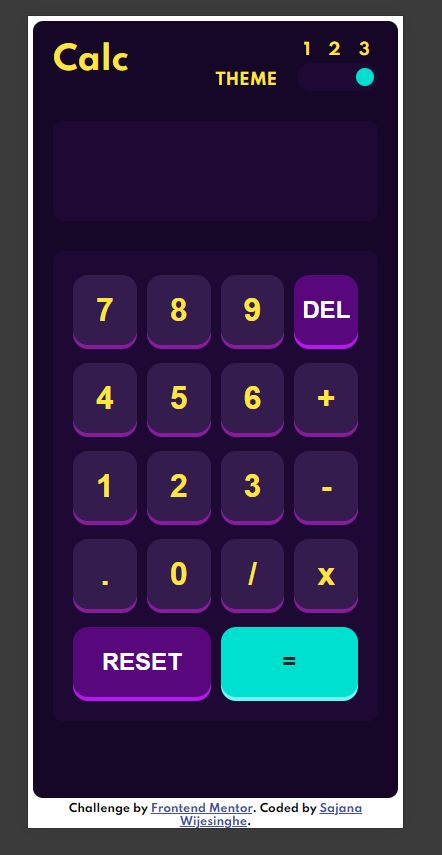

# Frontend Mentor - Calculator app solution

This is a solution to the [Calculator app challenge on Frontend Mentor](https://www.frontendmentor.io/solutions/responsive-website-with-a-mobilefirst-approach-8tFcVsRG3). 
Frontend Mentor challenges help you improve your coding skills by building realistic projects. 

## Table of contents

- [Overview](#overview)
  - [The challenge](#the-challenge)
  - [Screenshot](#screenshot)
  - [Links](#links)
- [My process](#my-process)
  - [Built with](#built-with)
  - [What I learned](#what-i-learned)
- [Author](#author)

## Overview

### The challenge

Users should be able to:

- See the size of the elements adjust based on their device's screen size
- Perform mathmatical operations like addition, subtraction, multiplication, and division
- Adjust the color theme based on their preference

### Screenshot

### Links

- Solution URL: [https://github.com/StormKing969/Frontend-Mentor---Calculator-App](https://github.com/StormKing969/Frontend-Mentor---Calculator-App)
- Live Site URL: [https://stormking969.github.io/Frontend-Mentor---Calculator-App/](https://stormking969.github.io/Frontend-Mentor---Calculator-App/)

## My process

### Built with

- Semantic HTML5 markup
- CSS custom properties
- CSS Grid
- Mobile-first workflow
- JavaScript 

## Author

- Website - [Sajana Wijesinghe](https://www.your-site.com)
- Frontend Mentor - [ @StormKing969](https://www.frontendmentor.io/profile/StormKing969)
